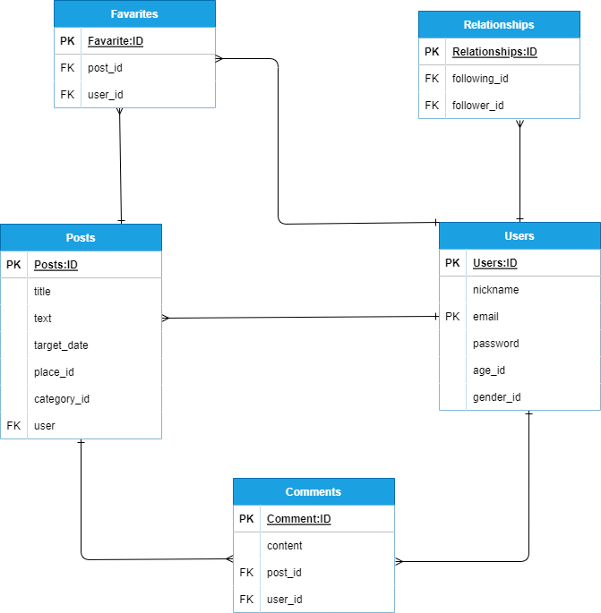

## アプリケーション名
「EXERCISE」

## アプリケーション概要
普段の日常生活での身体を動かすという運動に対しての意識を高めることを目的としたアプリケーション

## URL
https://exercise-6i8n.onrender.com

## テスト用アカウント
・メールアドレス: sample@sample.com

・パスワード: sample01

・フォロー確認用メールアドレス: test@test

・フォロー確認用パスワード: test01

## 利用方法

### 運動記録投稿
１．トップページのヘッダーからユーザー新規登録を行う

２．記録投稿ボタンから記録の内容（タイトル・テキスト・カテゴリー・場所）を入力し投稿する

### 他者に対してコメントする
１．ログインした後、トップページから記録のタイトルをクリックし、詳細ページへ移動

２．コメントフォームへ入力することでコメントできるようになっている

## アプリケーションを作成した背景
自分自身が家での活動が主になっているので、あまり外に出ないことから「運動に対して苦手意識がある」という課題を抱えていることが分かった。

課題を分析した結果、「運動に対する認識が高い」ということが真因であると仮説を立てた。同様の問題を抱えている方も多いと推測し、真因を解決
する為に記録を共有し、ユーザー同士でコミュニケーションを促進できるアプリケーションを開発することにした。

## 実装した機能についての画像やGIF及びその説明
### トップページ

### 新規登録ページ

ニックネームとメールアドレスとパスワードを入力してユーザー登録できる。

### ログインページ

メールアドレスとパスワードを入力してログインできる。

### 記録投稿ページ

トップページの右上にある記録投稿ボタンから記録投稿ページへ遷移し、記録タイトルや運動記録詳細、カテゴリ、場所、実施日を入力することで投稿することができる。

### 投稿詳細ページ

#### コメント投稿機能

投稿詳細ページ内にてログインしているユーザーであれば、コメントが投稿できる。

##### コメント編集機能

詳細ページのコメントをクリックすることでコメント編集ページへ遷移し、変更したコメントを入力し、「コメントする」をクリックすることでコメント内容を変更することができる。

##### コメント削除機能

コメント編集ページにて「コメント削除」ボタンをクリックすることで、そのコメントを削除することができる。

##### フォロー機能

トップページの投稿一覧からフォローしたいユーザーのマイページへ移動し、「フォローする」のボタンをクリックすることで他のユーザーをフォローすることができ、またフォローした後、「フォロー中」のボタンをクリックすることでフォローを解除することもできる。

## 実装予定の機能
現在、お気に入り機能を実装中。
今後、検索機能、タグ機能を実装予定

## データベース設計

## 開発環境
- Ruby

- Ruby on Rails

- HTML

- CSS

- PostgreSQL